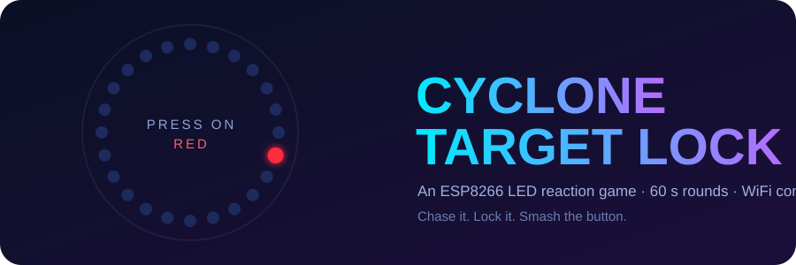
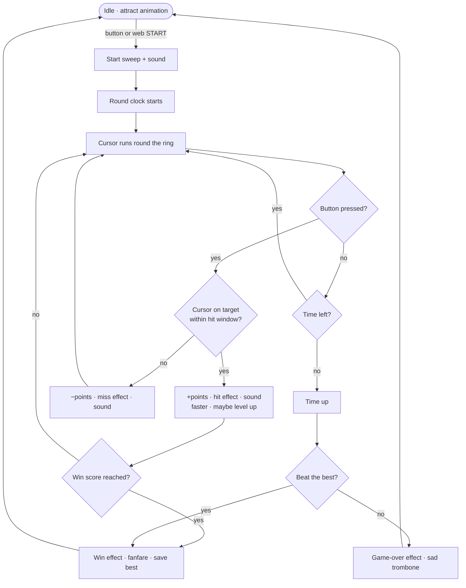
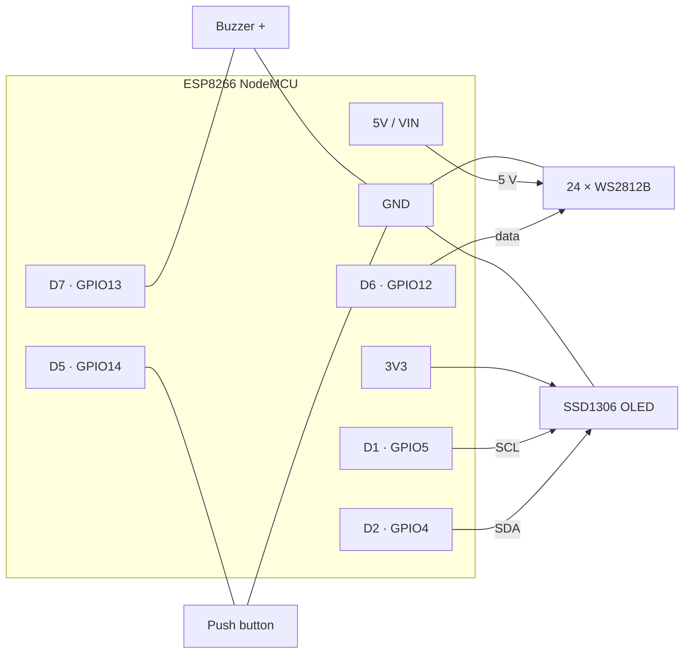
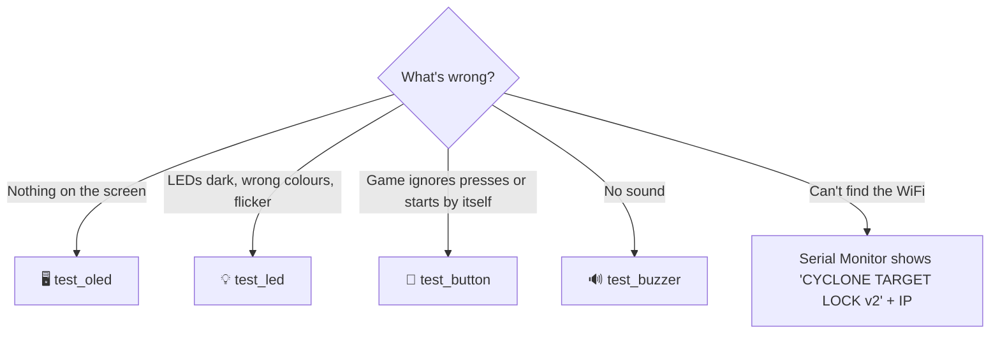

<div align="center">



<br>


**A cursor spins. A target hides in the ring. You get one button and 60 seconds.**

[🎮 How to play](#-how-to-play) ·
[📱 Web panel](#-the-web-control-panel) ·
[🔌 Wiring](#-wiring) ·
[🚀 Get started](#-get-started) ·
[🧪 Hardware tests](#-hardware-tests) ·
[🛠 Troubleshooting](#-troubleshooting)

</div>

---

## 🌀 What is this?

**Cyclone Target Lock** is a reaction game you can build in an evening. A ring of 24 WS2812B LEDs shows a **green cursor** racing round the circle and one **red target** LED. Hit the button *exactly* when the cursor sits on the target and you lock it in, miss and you lose points. The cursor speeds up as you score, and when the **round timer** (60 s by default) runs out the game ends with a game-over or victory show.

Version 2 adds a full **WiFi control panel** on your phone: change the round time, colours, LED effects, buzzer sounds, difficulty, presets and more, **live, while you play**.

> **Why "Target Lock"?** It is a *lock-on* game: you are not stacking or dodging, you are timing one press to lock a moving cursor onto a single target.

### ✨ Feature list

| | |
|---|---|
| ⏱ **Timed rounds** | 10 s to 10 min, default **60 s**, adjustable on the web page. Game ends when time is up. |
| 🎨 **Live colour control** | target, cursor, background, hit, miss, game-over, win, start-sweep and idle colours |
| 🏃 **Running cursor** | comet tail (0–8 LEDs), pulsing target, 4 direction modes |
| 💥 **6 LED effect styles** | Blink · Ripple · Sparkle · Rainbow · Spin · Fill up |
| 🔢 **Blink counts + timing** | separate blink count and speed for hit, miss, game over and win |
| 🔊 **11 buzzer sounds** | pick a sound for round start, hit, level up, miss, game over, win, countdown tick |
| 💾 **Presets** | 7 built-in looks + 3 save slots stored on the device |
| 🧠 **Smart extras** | hit window, time bonus / penalty, win score, level-up, countdown ticks, auto-save, export / import |
| 📟 **OLED scoreboard** | score, best, level, time bar, result screen |

---

## 🎮 How to play

```
              ● ● ● ● ●
           ●             ●
         ●                 ●        🟢 cursor   – keeps moving round the ring
        ●                   ●       🔴 target   – the LED you must catch
        ●     TARGET LOCK   ●       🔵 ring     – dim background LEDs
        ●                   ●
         ●        🔴       ●        Press when 🟢 lands on 🔴 !
           ●      🟢     ●
              ● ● ● ● ●
```

1. **Power on.** The LEDs run an idle "attract" animation and the OLED shows your best score.
2. **Press the button** (or **START** on the web page). A blue sweep and a power-up sound start the round.
3. **Score as many hits as you can before the timer runs out** (default 60 s).
4. **The round ends** with a game-over show, or a celebration if you beat your best score. The result stays on the OLED. Press the button to go again.

| You press… | Result | Then |
|---|---|---|
| on the target | **+1 point** (hit effect + sound) | new target, cursor gets faster |
| anywhere else | **−1 point** (never below 0, miss effect + sound) | new target |
| *(new level)* | every 5 points | level-up sound |

Hit / miss effects **pause the round clock**, so a long celebration never costs you time.

<details>
<summary><b>📈 The speed curve (default settings)</b></summary>

<br>

| Score | Level | Step delay | Feels like |
|:---:|:---:|:---:|---|
| 0 | 1 | 80 ms | warm-up 🐢 |
| 5 | 2 | 70 ms | easy 🚶 |
| 10 | 3 | 60 ms | getting serious 🏃 |
| 20 | 5 | 40 ms | fast ⚡ |
| 30+ | 7+ | 20 ms *(cap)* | cyclone 🌪 |

`delay = max(fastest, startSpeed − score × speedUpPerPoint)` and `level = score ÷ pointsPerLevel + 1`. Every number is a slider on the web page.

</details>

<details>
<summary><b>🖥 What the OLED shows</b></summary>

<br>

```
 while playing                      after the round
┌────────────────────────┐        ┌────────────────────────┐
│SCORE            TIME   │        │NEW BEST!               │
│12                42    │        │SCORE            BEST   │
│                        │        │14                14    │
│BEST 31          LV 3   │        │                        │
│[██████████░░░░░░░░░░░] │        │Press button to play    │
└────────────────────────┘        └────────────────────────┘
```

</details>

<details>
<summary><b>🔁 Game flow diagram</b></summary>



</details>

---

## 📱 The web control panel

1. Join the WiFi **`CycloneGame`** (password **`12345678`**).
2. Open **http://192.168.4.1**.

The page shows a live ring preview (it simulates *your* current colours, tail and speed), the round clock, score, best and level, plus **START / STOP / RESET**. Every change is applied **instantly** and **auto-saved** to the device a moment after your last edit (never in the middle of a round).

| Tab | What you can change |
|---|---|
| **Game** | round time · win score · time bonus per hit / penalty per miss · start speed, fastest speed, speed-up per point · points per level · points per hit, penalty per miss · hit window · LED count · brightness · direction |
| **Look** | cursor / target / background colours · comet tail length · pulsing target · start-sweep colour and speed · idle animation (Off / Chase / Rainbow / Breathe / Sparkle) |
| **Effects** | for **hit**, **miss**, **game over** and **win**: style, **blink count**, blink time, colour, and a **▶ Test** button |
| **Sound** | buzzer on/off · a sound for each event with **▶ preview** · countdown ticks in the last N seconds · step click |
| **Presets** | 7 built-in presets and 3 personal save slots |
| **System** | device info · export / import settings as a file · reset high score · factory reset · reboot |

<details>
<summary><b>💥 Effect styles</b></summary>

<br>

| Style | Looks like |
|---|---|
| **Blink** | the whole ring flashes on / off |
| **Ripple** | a ring of light expands from where you pressed |
| **Sparkle** | random twinkles |
| **Rainbow** | a rotating colour wheel |
| **Spin** | a comet races round the ring |
| **Fill up** | the ring fills from the cursor position |

One **blink** = 2 × *blink time*. Effect length = blinks × 2 × blink time. Hit / miss effects are capped at 2 s, game-over / win at 15 s. Set blinks to **0** to switch an effect off.

</details>

<details>
<summary><b>🔊 Buzzer sounds</b></summary>

<br>

`Beep` · `Chirp up` · `Chirp down` · `Coin` · `Low buzz` · `Fanfare` · `Sad trombone` · `Siren` · `Power up` · `Laser` · `Tick` (or `Off`)

Defaults: start = Power up, hit = Chirp up, level-up = Coin, miss = Low buzz, game over = Sad trombone, win = Fanfare, countdown = Tick for the last 5 s. Sounds run in the background, so they never freeze the game.

</details>

<details>
<summary><b>🎛 Presets</b></summary>

<br>

| Preset | Idea |
|---|---|
| **Classic** | the original look: green cursor, red target, 60 s |
| **Neon Night** | cyan comet, pulsing magenta target, ripple effects |
| **Arcade** | yellow cursor, coin sounds, fill-up hit effect |
| **Easy** | slower cursor, ±1 LED hit window, no penalty, 90 s, +1 s per hit |
| **Hard** | fast cursor, −2 points and −2 s per miss, 45 s, direction flips on every hit |
| **Party** | rainbow idle, sparkles, random direction, huge finale |
| **Stealth** | dim and silent |

Presets keep your LED count. **My presets** store *every* setting in one of 3 slots in the ESP8266's flash, so they survive power-offs.

</details>

<details>
<summary><b>💡 "Other suggestions" that are already built in</b></summary>

<br>

- **Hit window** – accept presses ±1–3 LEDs from the target (great for kids)
- **Time bonus / penalty** – +N s on a hit, −N s on a miss
- **Win score** – reach a score to win the round early
- **Direction modes** – clockwise, counter-clockwise, flip on every hit, random on every hit
- **Comet tail and pulsing target** for a smoother, more readable cursor
- **Countdown ticks** in the last seconds, **level-up sound**, optional **step click**
- **Idle attract animations** so the game looks alive when nobody is playing
- **Smart targets** – a new target never appears on top of the cursor
- **Power limiter** (1.5 A) so a big white flash can't brown-out a USB supply
- **Auto-save**, **export / import** as JSON, **factory reset**

</details>

<details>
<summary><b>🔗 HTTP API (for scripting)</b></summary>

<br>

The web page is a thin client on top of a small JSON API:

| Route | Purpose |
|---|---|
| `GET /api/state` | mode, score, best, level, time left |
| `GET /api/settings` | every setting + limits + option lists |
| `POST /api/set` | set any subset of settings, e.g. `roundSeconds=90&cCursor=%2300ffff` |
| `GET /api/start` · `/api/stop` · `/api/reset` | game control |
| `GET /api/preset?id=0..6` | apply a built-in preset |
| `GET /api/slot?op=save\|load&i=0..2` | personal preset slots |
| `GET /api/test?fx=hit\|miss\|over\|win\|start` | preview an effect (game must be idle) |
| `GET /api/test?sound=0..11` | preview a sound |
| `GET /api/resethigh` · `/api/factory` · `/api/reboot` | maintenance |

```bash
curl -X POST http://192.168.4.1/api/set -d "roundSeconds=90" -d "speedDelay=60"
curl http://192.168.4.1/api/start
```

</details>

---

## 🧰 What you need

| # | Part | Notes |
|:-:|---|---|
| 1 | **ESP8266 NodeMCU** (ESP-12E) | any board selectable as *NodeMCU 1.0* |
| 2 | **24 × WS2812B** ring / strip | 5 V, data-in on the first LED |
| 3 | **SSD1306 OLED 128×64, I²C** | address `0x3C` (some are `0x3D`) |
| 4 | **Push button** | momentary, normally-open |
| 5 | **Passive buzzer** | an *active* buzzer works but only makes one fixed tone |
| 6 | **5 V supply ≥ 2 A** | recommended for the LEDs (USB is fine at low brightness) |
| 7 | Wires, breadboard | + optional 330 Ω resistor and 1000 µF capacitor for the LEDs |

---

## 🔌 Wiring

| Part | Part pin | NodeMCU pin | GPIO |
|---|---|---|:-:|
| **WS2812B ring** | DIN | **D6** | GPIO12 |
| | 5V | 5V / external 5 V | – |
| | GND | GND *(shared!)* | – |
| **Push button** | leg 1 | **D5** | GPIO14 |
| | leg 2 | GND | – |
| **Buzzer** | + | **D7** | GPIO13 |
| | − | GND | – |
| **OLED** | SDA | **D2** | GPIO4 |
| | SCL | **D1** | GPIO5 |
| | VCC | **3V3** | – |
| | GND | GND | – |



<details>
<summary><b>⚠️ Power tips for the LED ring</b></summary>

<br>

- 24 LEDs at full white can pull **~1.4 A**. The game limits itself to 1.5 A (`LED_MAX_MA` in `main.cpp`) and defaults to brightness 100/255.
- **Always join the grounds** (supply GND ↔ NodeMCU GND ↔ LED GND).
- Add a **1000 µF capacitor** across the ring's 5 V/GND and a **~330 Ω resistor** in the data line.
- WS2812B *usually* accepts the ESP8266's 3.3 V data signal; if the first LED misbehaves add a level shifter.
- The button uses the internal pull-up: no external resistor needed.

</details>

---

## 🚀 Get started

Pick your weapon. Both use the **same game code**.

| | 🟦 Arduino IDE | 🟧 PlatformIO in VS Code |
|---|---|---|
| Best for | quick flash, beginners | editing, environments, automatic libraries |
| Open | `arduino/CycloneTargetLock/CycloneTargetLock.ino` | this folder |
| Libraries | install by hand (once) | downloaded automatically |
| Code lives in | the sketch folder | [`src/`](src/) |

<details open>
<summary><h3>🟦 Option A — Arduino IDE</h3></summary>

1. **Install the ESP8266 board package.** *File → Preferences → Additional Boards Manager URLs*:
   ```
   http://arduino.esp8266.com/stable/package_esp8266com_index.json
   ```
   Then *Tools → Board → Boards Manager…*, search **esp8266** and install.
2. **Install the libraries** (*Sketch → Include Library → Manage Libraries…*): `FastLED`, `Adafruit GFX Library`, `Adafruit SSD1306` (accept `Adafruit BusIO`).
3. **Open the sketch:** *File → Open…* → [`arduino/CycloneTargetLock/CycloneTargetLock.ino`](arduino/CycloneTargetLock/CycloneTargetLock.ino). The other files in that folder (`settings`, `sounds`, `effects`, `webui`) open as tabs automatically.
4. **Board:** *Tools → Board → esp8266 → **NodeMCU 1.0 (ESP-12E Module)***. Upload speed `921600` (or `115200` if uploads fail).
5. **Port**, then **Upload ➜**.
6. Open the **Serial Monitor** at **115200** baud to see the IP.

> The sketch folder is generated from `src/`. If you edit code in `src/`, run `python tools/sync_arduino.py` to refresh it (see [Project structure](#-project-structure)).

</details>

<details open>
<summary><h3>🟧 Option B — PlatformIO in VS Code</h3></summary>

1. Install [VS Code](https://code.visualstudio.com/) and the **PlatformIO IDE** extension (VS Code recommends it automatically for this folder).
2. *File → Open Folder…* and choose the project. PlatformIO detects [`platformio.ini`](platformio.ini) and downloads the toolchain and libraries on first open.
3. Build and flash with the bottom toolbar (✔ build, ➜ upload, 🔌 monitor) **or**:

```bash
pio run -e game -t upload      # build + flash the game
pio device monitor             # serial monitor (115200 baud)
```

| Environment | What it builds | Command |
|---|---|---|
| `game` *(default)* | the full game | `pio run -e game -t upload` |
| `test_button` | push button test | `pio run -e test_button -t upload` |
| `test_led` | WS2812B ring test | `pio run -e test_led -t upload` |
| `test_oled` | OLED + I²C scanner test | `pio run -e test_oled -t upload` |
| `test_buzzer` | buzzer + all game sounds | `pio run -e test_buzzer -t upload` |

If PlatformIO picks the wrong COM port add `upload_port = COM5` under `[env]` in `platformio.ini`.

</details>

---

## 🧪 Hardware tests

Flash these tiny sketches **one part at a time** before the full game. Each prints a live report to the Serial Monitor (115200 baud).

| Test | Checks | Arduino IDE sketch | PlatformIO env |
|---|---|---|---|
| 🔘 **Button** | wiring, pull-up, debounce, press counter + hold time | [`ButtonTest`](hardware_tests/ButtonTest/ButtonTest.ino) | `test_button` |
| 💡 **RGB LEDs** | colour order, dead LEDs, LED count, power, rainbow | [`RgbLedTest`](hardware_tests/RgbLedTest/RgbLedTest.ino) | `test_led` |
| 🖥 **OLED** | I²C scan, address, text, shapes, invert | [`OledTest`](hardware_tests/OledTest/OledTest.ino) | `test_oled` |
| 🔊 **Buzzer** | wiring, scale, every game sound effect | [`BuzzerTest`](hardware_tests/BuzzerTest/BuzzerTest.ino) | `test_buzzer` |

<details>
<summary><b>🔘 Button test — what you should see</b></summary>

```
PRESS   #1
RELEASE  held for 184 ms
PRESS   #2
RELEASE  held for 92 ms
[idle] raw pin = HIGH (not pressed) | presses so far: 2
```

One press must print exactly one `PRESS` line. Several = loose wire.

</details>

<details>
<summary><b>💡 RGB LED test — the five stages</b></summary>

1. **Colour check** – red → green → blue → white. If red shows as green change `GRB` to `RGB` (in the test *and* `FastLED.addLeds` in `main.cpp`).
2. **Walking dot** – one white LED visits every position; a gap means a dead LED.
3. **Cyclone chase** – a mini game.
4. **Rainbow** – smooth colour wheel.
5. **Breathing** – brightness fades (flicker means weak power).

</details>

<details>
<summary><b>🖥 OLED test — what you should see</b></summary>

```
Scanning I2C bus...
  device found at 0x3C
Display initialised OK
```

Then text sizes → shapes → a spinning ring → progress bar → inverted flash. `No I2C devices found` = swapped SDA/SCL or no power. `0x3D` found → change `OLED_ADDRESS`.

</details>

<details>
<summary><b>🔊 Buzzer test — what you should hear</b></summary>

A rising 8-note scale, then each game sound with its name on the Serial Monitor. Silence = wrong pin or wrong polarity. One ugly constant tone for everything = you have an *active* buzzer.

</details>

<details>
<summary><b>🧭 "Something's off" — which test do I run?</b></summary>



</details>

---

## 📁 Project structure

```
cyclone_game_2/
├── README.md
├── platformio.ini                     ← PlatformIO: game + 4 test environments
├── src/                               ← 🟧 the game (single source of truth)
│   ├── main.cpp                       game loop, rules, OLED, web API
│   ├── settings.h / .cpp              every setting, presets, EEPROM storage
│   ├── effects.h / .cpp               LED effect + idle animation renderers
│   ├── sounds.h / .cpp                buzzer sound table + non-blocking player
│   ├── webui.h                        the web control panel (HTML/CSS/JS)
│   └── hardware_tests/                tiny wrappers so PlatformIO can build the tests
├── arduino/
│   └── CycloneTargetLock/             ← 🟦 generated copy for the Arduino IDE
├── hardware_tests/                    ← 🧪 standalone test sketches (both toolchains)
│   ├── ButtonTest/  RgbLedTest/  OledTest/  BuzzerTest/
├── tools/
│   └── sync_arduino.py                copies src/ → arduino/CycloneTargetLock/
├── docs/banner.svg                    animated README banner
└── .vscode/extensions.json            recommends the PlatformIO extension
```

**Editing the game:** change the code in `src/`, then run

```bash
python tools/sync_arduino.py
```

to refresh the Arduino IDE sketch (`main.cpp` becomes `CycloneTargetLock.ino`). Only edit `src/`, never the generated folder. The test sketches exist once in `hardware_tests/`.

### 🧩 How the firmware is organised

| Piece | Idea |
|---|---|
| **State machine** | `IDLE → STARTING → PLAYING ⇄ FX → ENDING → IDLE`. No `delay()` in the game, so the web page, buzzer and LEDs never freeze each other. |
| **Field table** | every setting is one row in `settings.cpp`. The web API, limits, JSON and the EEPROM clamp are all generated from that table, so adding a setting is one line there + one line in the web page. |
| **Settings storage** | `EEPROM`: high score at address 0, live settings and 3 user slots after it. A layout version discards incompatible data after firmware changes. |

---

## 🛠 Troubleshooting

<details>
<summary><b>Upload fails / "port not found"</b></summary>

Use a **data** USB cable, install the CH340 / CP210x driver, pick the right port, and lower the upload speed to `115200`.

</details>

<details>
<summary><b>OLED stays blank</b></summary>

Run `test_oled`. Check SDA→D2, SCL→D1, 3V3, GND. `0x3D` in the scan → change `OLED_ADDRESS`. Some 1.3" modules are SH1106 and need a different driver.

</details>

<details>
<summary><b>LEDs show wrong colours / flicker</b></summary>

Change `GRB` to `RGB` in `FastLED.addLeds<WS2812B, LED_PIN, GRB>` (verify with `test_led`). For flicker: join the grounds, add the capacitor + 330 Ω resistor, lower the brightness, use a proper 5 V supply.

</details>

<details>
<summary><b>No sound / the same tone for every sound</b></summary>

Run `test_buzzer`. Check + → D7 and − → GND, and that the **Buzzer** switch is on (web page → Sound). Same tone everywhere = active buzzer; use a passive one.

</details>

<details>
<summary><b>The web page shows "offline"</b></summary>

Make sure your phone is still on `CycloneGame` (phones sometimes hop back to mobile data because the network has no internet: tell it to *stay connected*), then open `http://192.168.4.1` again. The ESP8266 is 2.4 GHz only.

</details>

<details>
<summary><b>My settings vanished</b></summary>

Settings save ~1.5 s after your last change and **never during a round**, so finish or stop the game and wait a moment before cutting power. **System → Factory reset** restores the defaults.

</details>

<details>
<summary><b>The button starts the game on its own</b></summary>

The button must go between **D5 and GND**. Run `test_button`; a floating wire causes phantom presses.

</details>

---

## 🗺 Ideas for next

- [ ] Two-player duel mode (two buttons, first to lock wins the point)
- [ ] Captive portal, so the control panel pops up as soon as you join the WiFi
- [ ] Top-10 leaderboard with player names
- [ ] "Hold the lock" mode: keep the button down for a full second on the target
- [ ] Rotary encoder to change difficulty without a phone
- [ ] Editable WiFi name / password on the System tab
- [ ] Battery pack + charger for a portable arcade box

---

## 👥 Contributors

<table>
  <tr>
    <td align="center">
      <a href="https://github.com/Am4l-babu">
        <br>
        <sub><b>Am4l-babu</b></sub>
      </a><br>
      <sub>Creator &amp; maintainer</sub>
    </td>
  </tr>
</table>

Ideas and pull requests are welcome. Fork the repo, change the code in `src/`, run `python tools/sync_arduino.py`, and open a PR.

---

<div align="center">

**Designed, built and written by [Am4l-babu](https://github.com/Am4l-babu)**

Built with ⚡ ESP8266, 🌈 FastLED and a lot of blinking.

**Now go lock that target.** 🎯

</div>
